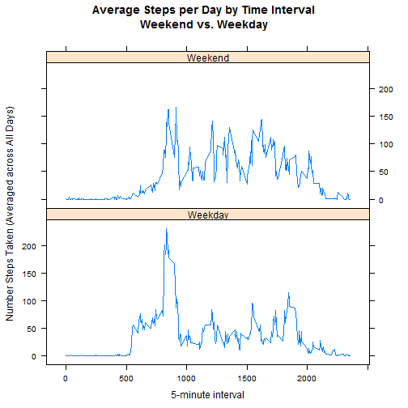

Reproducible Research Peer Assessment 1
---

This assignment analyzes data from a personal activity monitoring device collected from an anonymous individual for two months from October to November 2012. Variables include:

- steps: Number of steps taken in a 5-minute interval (missing values are coded as NA)

- date: The date on which the measurement was taken in YYYY-MM-DD format

- interval: Identifier for the 5-minute interval in which measurement was taken

[Download full dataset](https://d396qusza40orc.cloudfront.net/repdata%2Fdata%2Factivity.zip)

###Load and Preprocess Data


```r
setwd("~/Coursera/Reproducible Research/Course Project 1")
activity <- read.csv("activity.csv", header=TRUE, stringsAsFactors=FALSE)
```

###Mean Number of Steps per Day


```r
# Exclude missing values
complete <- complete.cases(activity)
complete <- activity[complete, ] 

stepsbyday <- aggregate(steps ~ date, data=complete, sum) 
meansteps <- mean(stepsbyday$steps)
mediansteps <- median(stepsbyday$steps)
```


The histogram below shows the distribution of total steps taken per day. This portion of the assignment ignores missing values (NA) in the dataset. 


```r
hist(stepsbyday$steps, main="Total Steps per Day\n(excludes missing values)", xlab="Steps per Day", col="slategray3")
```


Excluding missing values, the individual represented in this dataset averaged 10,766 **mean** total steps per day and 10,765 **median** steps per day.


##Average Daily Activity Pattern


```r
stepsbyinterval <- aggregate(steps ~ interval, data=complete, sum)
avgstepsbyinterval <- stepsbyinterval
numdays <- length(unique(complete$date))
avgstepsbyinterval$steps <- avgstepsbyinterval$steps/numdays

maxinterval <- avgstepsbyinterval[which (avgstepsbyinterval$steps == max(avgstepsbyinterval$steps)),"interval" ]
```


The time series plot below shows the average number of steps taken per 5-minute time interval, averaged across all days.


```r
plot(avgstepsbyinterval, main="Average Steps per Day by Time Interval", xlab="5-minute interval", ylab="Number Steps Taken (Averaged across All Days)", type="l")
```


Averaged across all the days, the **835** time interval contains the maximum number of steps taken.


###Inputing Missing Values


```r
missing <- sum(is.na(activity))
```

The dataset includes a total of 2304 rows with missing values (NA).  Missing values are populated using the average steps per time interval across all days with data available.  The imputed dataset reflects the original activity dataset but with missing values filled in.


```r
imputed <- activity
for (i in 1:nrow(imputed)) {
        if (is.na(imputed$steps[i])) 
                {imputed$steps[i] <- avgstepsbyinterval$steps[which(avgstepsbyinterval$interval == imputed$interval[i])]
                imputed$imputed[i] <- "Y"}   
        else {imputed$imputed[i] <- "N"}
}

stepsbydayimputed <- aggregate(steps ~ date, data=imputed, sum)
meanstepsimputed <- mean(stepsbydayimputed$steps)
medianstepsimputed <- median(stepsbydayimputed$steps)
```

Imputing missing data using the methodology described above has limited impact on the mean or median total steps per day. The histogram below shows the distribution of total steps taken per day with missing values filled in.


```r
hist(stepsbydayimputed$steps, main="Total Steps per Day\n(missing values are imputed)", xlab="Steps per Day", col="slategray3") 
```


With missing values filled in, the **mean** total steps per day remains unchanged at 10,766.  The **median** steps per day increases slightly from 10,765 to 10,766.

###Activity Pattern - Weekday versus Weekend


```r
#Determine day and search/replace with weekday or weekend
imputed$day <- weekdays(strptime(imputed$date, format = "%Y-%m-%d"))
imputed$weekday <- gsub("Monday|Tuesday|Wednesday|Thursday|Friday", "Weekday", imputed$day)
imputed$weekday <- gsub("Saturday|Sunday", "Weekend", imputed$weekday)
imputed$weekday <- as.factor(imputed$weekday)
numweekdays <- length(unique(imputed[which (imputed$weekday == "Weekday"),"date"]))
numweekenddays <- length(unique(imputed[which (imputed$weekday == "Weekend"),"date"]))

stepsbyinterval <- aggregate(steps ~ interval + weekday, data=imputed, sum)
avgstepsbyinterval <- stepsbyinterval

for (i in 1:nrow(avgstepsbyinterval)) {
        if (avgstepsbyinterval$weekday[i] == "Weekday") {avgstepsbyinterval$steps[i] <- avgstepsbyinterval$steps[i]/numweekdays}
        if (avgstepsbyinterval$weekday[i] == "Weekend") {avgstepsbyinterval$steps[i] <- avgstepsbyinterval$steps[i]/numweekenddays}
}
```


The panel plot below shows the difference in activity patterns between weekdays and weekends.  This portion of the assignment uses the imputed dataset with missing values filled in.


```r
library(lattice)
xyplot(steps ~ interval | weekday, data = avgstepsbyinterval, main="Average Steps per Day by Time Interval\nWeekend vs. Weekday",xlab="5-minute interval", ylab="Number Steps Taken (Averaged across All Days)", type="l", layout=c(1,2))
```


